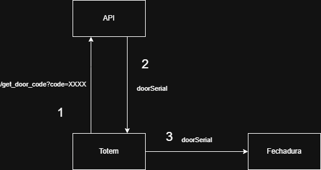

# Totem para Raspberry Pi - Projeto WorkUp

Este projeto é uma interface gráfica simples e funcional feita em Python com Tkinter que simula um teclado numérico, ideal para sistemas touchscreen, como o Raspberry Pi 3.

A ideia é simular o comportamento do totem de abertura da fechadura eletrônica, que utiliza a API de reservas do WorkUp para pegar o código de entrada da porta e abrir a fechadura se o código for válido.


## Requisitos

RF01 - O sistema deve apresentar um teclado numérico com botões de 0 a 9.  
RF02 - O teclado deve estar organizado em layout tradicional de 3 colunas × 4 linhas.  
RF03 - O sistema deve disponibilizar um campo para digitação da senha/código.  
RF04 - O campo de senha deve ocultar os caracteres digitados.  
RF05 - O sistema deve possuir um botão "Apagar" para remover o último dígito.  
RF06 - O sistema deve possuir um botão "Confirmar" para enviar o código digitado.  
RF07 - Após a confirmação, o sistema deve limpar o campo de senha.  
RF08 - O sistema deve exibir feedback ao usuário sobre sucesso ou falha na validação do código.  
RF09 - O sistema deve consumir a API do WorkUp para validar o código e autorizar a abertura da fechadura.  
RF10 - A interface deve iniciar em modo maximizado.  
RF11 - O layout deve se adaptar automaticamente ao tamanho da tela.  
RF12 - O sistema deve permitir interação via touchscreen.

---

## Tecnologias

* Python 3
* Tkinter (biblioteca padrão para interfaces gráficas no Python)

---

## Diagrama ilustrativo

<figure>
  
  <figcaption><strong>Figura 1:</strong> Arquitetura do projeto</figcaption>
</figure>

## Como usar

1. Certifique-se de ter o Python 3 instalado.
2. Clone este repositório:

   ```bash
   git clone https://github.com/WorkUpMaua/totem_workup.git
   ```
3. Ative o ambiente virtual (Linux/MacOS)

      ```bash
   python -m venv venv
   source venv/bin/activate
   ```

4. Baixe as dependências (Linux/MacOS)

      ```bash
   pip install -r requirements.txt
   ```

5. Abra a aplicação

   ```bash
   python interface.py
   ```

---

## Captura de Tela


## Vídeo Demonstrativo do projeto

[Clique aqui para ver](https://youtube.com/shorts/3AmJxlv6VCY?feature=share)


## 🤝 Integrantes

- [João Paulo Bonagurio Ramirez](https://github.com/yJony)           | 22.01247-8
- [Lucas Milani Thomsen Galhardo](https://github.com/LucasKiller)    | 22.00818-7  
- [Lucas Olivares Borges da Silva](https://github.com/lvcasolivares) | 22.00889-6
- [Luis Gustavo Gonçalves Machado](https://github.com/luisgmachado)  | 21.00322-0
- [Tiago Tadeu de Azevedo](https://github.com/tiagooazevedo)         | 22.00856-0
- [Victor Augusto de Gasperi](https://github.com/VictorGasperi)      | 22.00765-2 